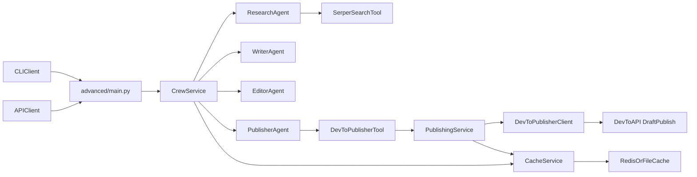

# Production Blogging Agent (CrewAI)

Production-grade backend for technical AI blogging:
- Accepts any topic
- Researches latest sources (date-grounded web search)
- Writes and edits a learner-focused blog (target 6-8 minute read)
- Publishes to Dev.to as **draft first**
- Supports both **CLI** and **API** runtime modes

## Learning path

This repo has two parts:

| Folder      | Audience                         | Purpose                                                                                                                                     |
|-------------|----------------------------------|---------------------------------------------------------------------------------------------------------------------------------------------|
| `Demo/`     | New AI agent learners            | Six Jupyter notebooks that grow a single LLM call into a 4-agent pipeline. Read these **first**.                                            |
| `advanced/` | Engineers shipping to production | The same pipeline wrapped in caching, FastAPI, rate limiting, idempotent publishing, and source-freshness retries. Read after Demo Step 06. |

Recommended reading order inside `advanced/`: `agents/` → `tasks/` → `tools/` → `services/crew_service.py` → `main.py`. The rest is infrastructure (settings, cache, security middleware).

## Architecture



## Project Structure

```text
blogging-agent/
├── Demo/                     # Notebooks for first-time AI agent learners
│   ├── 01_init.ipynb
│   ├── 02_research_agent.ipynb
│   ├── 03_research_agent_with_tool.ipynb
│   ├── 04_content_writer_agent.ipynb
│   ├── 05_editor_agent.ipynb
│   ├── 06_publish_agent.ipynb
│   └── README.md
├── advanced/                 # Production-shaped version of the same pipeline
│   ├── agents/
│   ├── tasks/
│   ├── tools/
│   ├── services/
│   ├── models/
│   ├── config/
│   ├── utils/
│   └── main.py
├── tests/
├── data/
│   ├── cache/
│   ├── outputs/
│   └── logs/
├── pyproject.toml
└── README.md
```

## Environment Variables

Create `.env` in repo root:

```bash
cp .env.example .env
```

Then edit values:

```bash
OPENROUTER_API_KEY=your_openrouter_key
SERPER_API_KEY=your_serper_key
DEVTO_API_KEY=your_devto_key  # required only for publish=true
API_AUTH_KEY=replace_with_a_long_random_key

# Optional
MODEL_NAME=openai/gpt-4o
OPENROUTER_BASE_URL=https://openrouter.ai/api/v1
CACHE_BACKEND=file     # file or redis
REDIS_URL=redis://localhost:6379/0
PUBLISH_AS_DRAFT=true  # default is draft-first in code
LOG_LEVEL=INFO
API_AUTH_ENABLED=true
API_AUTH_HEADER_NAME=X-API-Key
API_RATE_LIMIT_ENABLED=true
API_RATE_LIMIT_PER_MINUTE=30
API_RATE_LIMIT_WINDOW_SECONDS=60
SOURCE_YEAR_RETRY_STEPS=3
```

## Setup (Local)

### 1) Install dependencies (uv only)

```bash
uv sync --extra dev
```

### 2) Run tests

```bash
uv run pytest
```

Important:
- Use `uv run ...` for all commands.
- Do not run bare `pytest` / `python` directly from global environment.

## Local Run Instructions

### CLI mode

Generate + publish (draft-first):

```bash
uv run python -m advanced.main generate-and-publish --topic "MCP servers for AI agents" --min-year 2026
```

Generate only (no publish):

```bash
uv run python -m advanced.main generate-only --topic "RAG evaluation in production" --min-year 2026
```

### API mode

Start API server:

```bash
uv run python -m advanced.main api --host 0.0.0.0 --port 8000
```

Generate endpoint:

```bash
curl -X POST http://localhost:8000/v1/blogs/generate \
  -H "X-API-Key: replace_with_a_long_random_key" \
  -H "Content-Type: application/json" \
  -d '{
    "topic": "Agentic observability patterns",
    "publish": false,
    "force_refresh": false,
    "min_year": 2026
  }'
```

## Redis Setup (Optional but Recommended)

### Docker

```bash
docker run --name blogging-agent-redis -p 6379:6379 -d redis:7
```

Then set:

```bash
CACHE_BACKEND=redis
REDIS_URL=redis://localhost:6379/0
```

### macOS (Homebrew)

```bash
brew install redis
brew services start redis
```

## Guardrails and Reliability

- Date freshness: sources are expected from `min_year` onward (default 2026).
- If sources from `min_year` are insufficient, pipeline accumulates sources year-by-year from `min_year`, then `min_year - 1`, `min_year - 2`, and `min_year - 3` until `min_sources` is met.
- Structured output: editor task must return strict JSON.
- Readability: blog target is 6-8 minute read.
- Publishing policy: Dev.to draft-first by default.
- Resilience: retries/timeouts in external API tools.
- Cache fallback: Redis preferred, file cache fallback automatically.
- Idempotency: duplicate publish protection via idempotency key.
- API security: API key middleware with configurable header.
- API throttling: in-memory per-key request rate limiting (429 on exceed).

## Mode-Specific Required Variables

- Generate only (`publish=false`):
  - `OPENROUTER_API_KEY`
  - `SERPER_API_KEY`
  - `API_AUTH_KEY` (API mode only)
- Generate and publish (`publish=true`):
  - all above +
  - `DEVTO_API_KEY`

## Troubleshooting

- `Missing OPENROUTER_API_KEY` / `SERPER_API_KEY`: check `.env`.
- `Missing DEVTO_API_KEY`: only required when publishing (`publish=true`).
- `RuntimeError: API auth is enabled but API_AUTH_KEY is missing`: set `API_AUTH_KEY` or disable auth explicitly.
- `ModuleNotFoundError` during tests: run `uv sync --extra dev` and then `uv run pytest`.
- Serper failures: verify API key and outbound network.
- Dev.to publish failures: check `DEVTO_API_KEY` scope and API status.
- Redis unavailable: service automatically falls back to file cache.
- Validation errors on editor JSON: rerun with `--force-refresh` and inspect logs in `data/logs/`.
